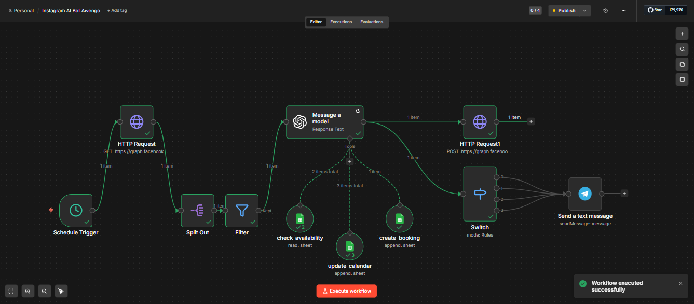

# hotel-booking-ai-automation
AI-powered Instagram agent for automated hotel booking logic. Built with n8n, Google Sheets, and Meta Graph API.
# AI Hotel Administrator for "Aivengo Sherwood" Complex 🏨🤖

A professional, high-logic AI Agent designed to automate the full cycle of guest relations for a boutique hotel complex. This agent acts as a Digital Administrator, offloading over 50% of routine tasks from the human staff.

## 🚀 Business Value
- **24/7 Availability:** Instant responses to guest inquiries at any time.
- **Admin Support:** Automatically checks cottage availability and makes entries in the manager's calendar.
- **Seamless Integration:** Featured on the official website via an "AI Administrator" button, directing traffic straight to Instagram Direct for a personalized experience.
- **Real-time Admin Notifications:** Integrated with Telegram Bot API to instantly alert human staff about new booking entries or urgent "Manager/Operator" requests. This ensures zero-miss communication and rapid human intervention when needed.
## 🌟 Key Capabilities
- **Availability & Booking:** Synchronizes with Google Sheets to provide real-time information on free dates and cottages. 
- **Knowledge Base:** Expertly answers questions about the complex: directions/location, internal rules, cottage amenities, and local services.
- **Workflow Automation:** Handles booking requests and prepares all necessary data for the live manager to finalize the reservation.
- **Policy Enforcement:** Smartly applies complex business rules, such as the mandatory 2-night minimum stay policy.
- **Human Escalation:** Knows exactly when to stop and hand over the conversation to a human operator for complex or high-priority requests.

## 🔗 Omnichannel Bridge
The system includes a dedicated UI element on the [official website](https://aivengo-sherwood.com.ua/) — an "AI Administrator" button. This allows web visitors to transition seamlessly into a guided AI conversation on Instagram with a single click.

## 🛠 Tech Stack
- **n8n:** Advanced workflow orchestration and logic.
- **Instagram Graph API:** Official communication channel.
- **Google Sheets:** Dynamic database for inventory, pricing, and calendar management.
- **OpenAI/Gemini:** The "brain" behind natural language understanding.

---
*Note: This repository showcases the architecture and business logic. API keys and private database credentials have been removed for security.*
